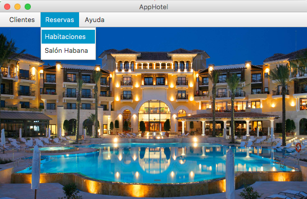
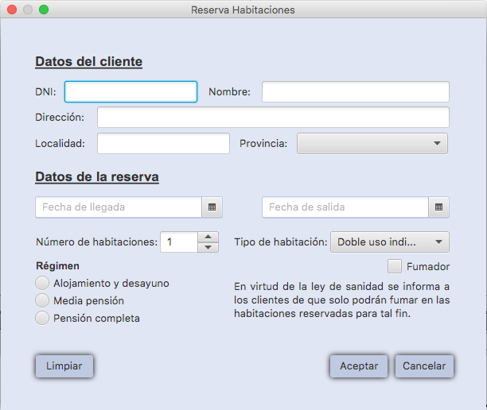
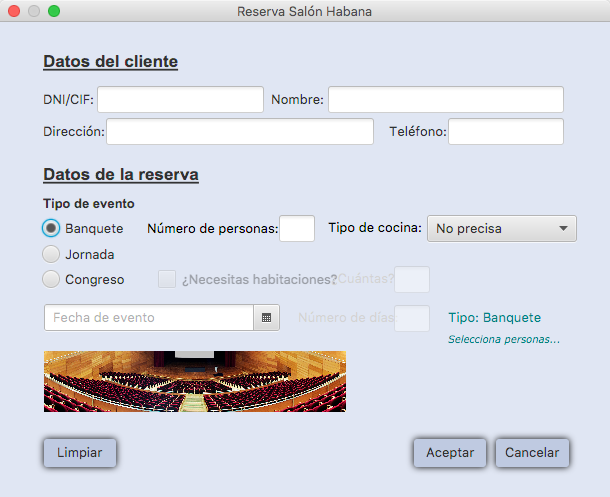
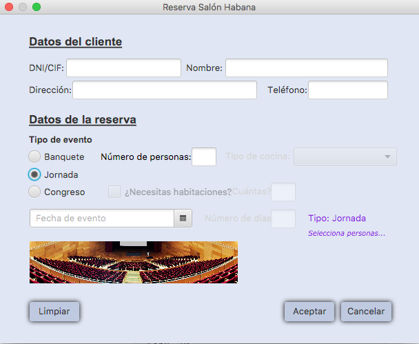
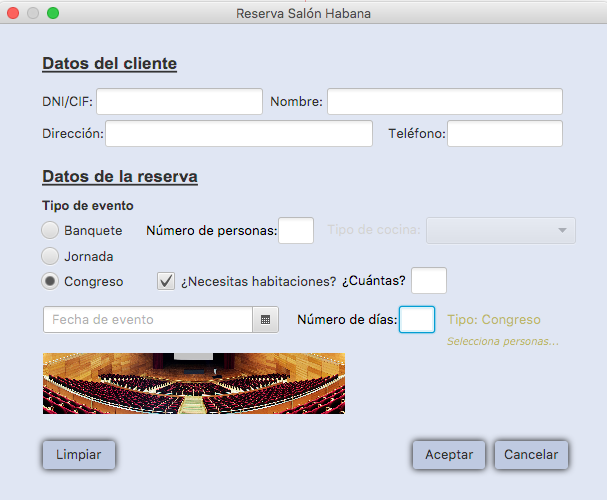

**AppHotel\_teamName:**

Cada equipo desarrollará una aplicación AppHotel de gestión de reservas de hotel, con una ventana inicial, con menú a las ventanas principales de las reservas. Se podrán organizar y distribuir los controles libremente sin perder la funcionalidad exigida.

 

Al hacer clic en Habitaciones se mostrará la interfaz de reservas de habitaciones.

**Reservas: Habitaciones**

 

En la imagen anterior se ve el escenario para rellenar con los datos de una reserva de habitaciones. En la zona superior aparece una etiqueta con el texto &quot; **Datos del cliente**&quot; y un conjunto de cuadros de textos con sus etiquetas asociadas. En concreto en la primera línea tenemos las parejas de etiqueta y cuadro de texto &quot;DNI&quot; y &quot;Nombre&quot;. En la siguiente línea tenemos &quot;Dirección&quot;. En la tercera línea tenemos &quot;Localidad&quot; y &quot;Provincia&quot;.

El comportamiento de estos controles (datos del cliente) será: al inicio solo editable el campo DNI, cuando el usuario introduzca un DNI, se realizará la búsqueda del cliente en la BD y si existe se mostrará la información del cliente cargando los controles de la interfaz relativos al cliente, Nombre, Dirección, Localidad y Provincia que seguirán siendo no editables. Si el DNI no existe, se harán editables los datos del cliente para realizar el alta del cliente, al mismo tiempo que se realiza el alta de la reserva.

A continuación aparece una etiqueta con el texto &quot; **Datos de la reserva**&quot; y dos controles de calendario con los textos &quot;Fecha de llegada&quot; y &quot;Fecha de salida&quot;. Debajo de ellos hay una etiqueta con el texto &quot;Número de habitaciones&quot; y una lista desplegable que muestra el número. A continuación aparece el texto &quot;Tipo de habitación&quot; y otra lista desplegable con el texto &quot;Doble de uso individual&quot;. Después tenemos una casilla de verificación desmarcada con el texto &quot;Fumador&quot;.

En la zona inferior del formulario hay a la izquierda un conjunto de botones de radio para seleccionar el régimen, pudiendo elegir ente &quot;Alojamiento y desayuno&quot;, &quot;Media pensión&quot;, y &quot;Pensión completa&quot;. A la derecha un texto que dice: &quot;En virtud de la ley de sanidad se informa a los clientes de que sólo podrán fumar en las habitaciones reservadas para tal fin&quot;.

Abajo del todo hay tres botones, a la izquierda un botón con el texto Limpiar y a la derecha, dos con los textos &quot;Aceptar&quot; y &quot;Cancelar&quot;.

Cuando se presione el botón &quot;Aceptar&quot; se deberán **validar** que están rellenos los datos obligatorios y que son introducidos de acuerdo a los formatos pertinentes según el diseño de la BD sobre la que se pretendan hacer persistentes los datos de la reserva, además de **grabar** la reserva se enviará un aviso que informe al usuario que la reserva se ha realizado correctamente. El botón &quot;Limpiar&quot; vaciará de contenidos los datos introducidos por el usuario en los controles. Y el botón &quot;Cancelar&quot; volverá a la pantalla principal sin realizar ninguna acción.

Al hacer clic en Habitaciones se mostrará la interfaz de reservas de Salón Habana.

**Reservas: Salón Habana**

Esta interfaz que permita gestionar la reserva de uno de los salones, llamado &quot;Salón Habana&quot;. Los requisitos que debe cumplir esta interfaz son:

1. Los datos de clientes tienen la misma gestión que la interfaz de reservas de habitaciones.

2. En los datos de la reserva hay que cumplimentar:

   a. Fecha del evento.

   b. Tipo, se puede escoger entre banquete, jornada o congreso. El componente será RadioButton (sólo puede ser de un tipo).Cuando se selecciona como tipo de evento banquete o jornada los componentes para número de días y habitaciones deben estar desactivados, sin embargo si es congreso se deben activar.

   c. Número de personas que asistirán. Para jornada y congreso un máximo de 50 personas. Para banquete, un máximo de 100 personas. Componente un TextField.

   d. Tipo de cocina que se precisará, a elegir entre bufé (vegetariano o no), carta, pedir cita con el chef o no precisa. Componente ComboBox.

3. Si el evento es un congreso se debe preguntar el número de jornadas del congreso (Text Field) y si se requerirán habitaciones para los asistentes al evento (Nº de habitaciones. Componente Text Field). Esto puedes hacerlo deshabilitando (setDisabled) los controles si no ha lugar.

4. Tanto para el nº de personas como para el nº de jornadas y nº de habitaciones se debe controlar que sólo se introduzcan datos de tipo entero. Se debe informar al usuario mediante mensaje de aplicación del tipo de datos a introducir Sólo en el caso de que el valor introducido no sea de tipo entero.

5. En el caso del nº de personas que asistirán se debe informar al usuario mediante mensaje de aplicación en el caso de que el valor introducido no esté incluido en los intervalos definidos según el tipo de evento (jornada, congreso, evento).

6. En el componente definido para introducir el nº de teléfono se debe controlar que el tipo de datos introducidos sean de tipo carácter y que sólo se admitan los caracteres comprendidos del 0 al 9.Se debe informar al usuario en el caso de que no se cumpla el requisito.

Por tanto, la tarea consistirá en generar una aplicación que cuente con un diálogo nuevo en el que crearás la interfaz con las restricciones que se indican más arriba. Además de añadir los componentes que necesites para darle funcionalidad deberás cumplir con los siguientes **requisitos no funcionales** :

- Debes añadir un ToolTip [[https://docs.oracle.com/javase/8/javafx/user-interface-tutorial/tooltip.htm](https://docs.oracle.com/javase/8/javafx/user-interface-tutorial/tooltip.htm)]  a cada uno de los componentes para ayudar al usuario.
- Modifica el formato de texto de las etiquetas y añade separadores y paneles con título para aportar vistosidad a la interfaz.
- Utiliza el modo de diseño libre para colocar los componentes en el escenario. Cuida que la composición quede armónica.
- Debes crear la interfaz modal.

**Recomendación** : Se pretende poner en práctica los conceptos aprendidos, de la forma más clara posible, por lo que recomiendo que hagáis un diseño previo de la interfaz y estudiéis dónde se van a posicionar los elementos de formulario.

**Reservas: Salón Habana ….Banquete**

 

**Reservas: Salón Habana ….Jornada**

 

**Reservas: Salón Habana ….Congreso**

 

**Sugerencia**: La **BD** la formarían las tablas: Cliente, Provincia, Reservas\_Hab y Reservas\_Salon. En estas dos últimas tablas solo sería necesario incluir el DNI del cliente en relación a los datos del cliente, además de los datos necesarios de cada reserva.